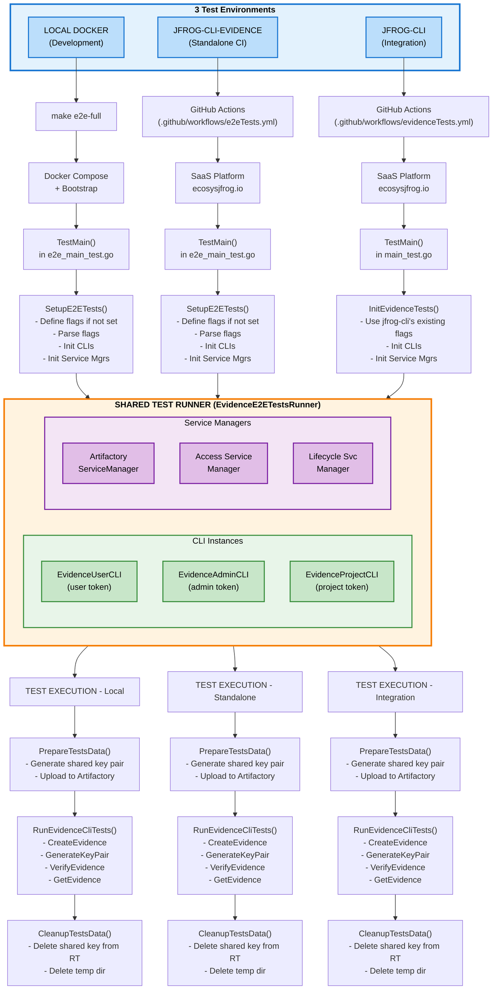

# JFrog CLI Evidence - E2E Tests

## Overview

End-to-end tests for JFrog CLI Evidence plugin that verify all CLI commands against real JFrog environments (local Docker or SaaS).

## Test Structure

```
tests/e2e/
├── e2e_setup.go              # Test environment initialization
├── tests/
│   ├── e2e_main_test.go      # TestMain entry point
│   ├── evidence_test.go      # Main test function (standalone only)
│   ├── suite_runner.go       # Test runner (shared with jfrog-cli)
│   ├── e2e_create_suite.go   # Tests for 'create' command
│   ├── e2e_verify_suite.go   # Tests for 'verify' command
│   ├── e2e_get_suite.go      # Tests for 'get' command
│   └── e2e_generate_key_suite.go  # Tests for 'generate-key-pair'
├── utils/                    # Test utilities
│   ├── e2e_artifactsx.go     # Artifact creation/cleanup
│   ├── e2e_buildsx.go        # Build info operations
│   ├── e2e_keysx.go          # Key management
│   ├── e2e_packagesx.go      # Package operations
│   ├── e2e_releasebundlesx.go  # Release bundle operations
│   └── e2e_repositoryx.go    # Repository management
└── local/                    # Local Docker environment
    ├── scripts/
    │   └── e2e-bootstrap.sh  # Bootstrap script (creates users, tokens, projects)
    └── artifactory.lic       # **YOU MUST ADD THIS FILE**
```

## How It Works

### Initialization (Before Tests)

1. **Flag Parsing**: Command-line flags are parsed (URLs, tokens)
2. **CLI Instances**: 3 CLI instances are created:
   - `EvidenceUserCli` - For regular operations (create, verify, get)
   - `EvidenceAdminCli` - For admin operations (key upload)
   - `EvidenceProjectCli` - For project-scoped tests (optional)
3. **Service Managers**: Artifactory, Access, and Lifecycle clients are initialized
4. **Shared Key Pair**: A test key pair is generated and uploaded to Artifactory
5. **Test Data**: Each test creates its own repositories, artifacts, builds, etc.

### Cleanup (After Tests)

✅ **Automatic cleanup using `t.Cleanup()`:**
- Repositories are deleted (including all artifacts)
- Build info is deleted
- Release bundles are deleted
- Shared key pair is deleted from Artifactory
- Temporary files are removed

## Running Tests

### Local Docker Environment

**Prerequisites:**

1. **Configure Docker Registry Access:**
   ```bash
   # Edit tests/e2e/local/.env and replace <YOUR_REGISTRY> with your actual registry URL
   vi tests/e2e/local/.env
   ```

2. **Add your Artifactory license file:**
   ```bash
   cp /path/to/artifactory.lic tests/e2e/local/artifactory.lic
   ```

3. **Start environment and run tests:**
   ```bash
   # Full cycle: clean, build, start env, run tests
   make e2e-full
   
   # Or step by step:
   make start-e2e-env   # Start Docker + bootstrap
   make test-e2e        # Run tests
   make stop-e2e-env    # Stop Docker
   ```

### SaaS Environment

Tests run against `https://ecosysjfrog.jfrog.io/` with pre-configured project `evidencee2e`.

```bash
go test ./tests/e2e/... \
  --jfrog.url=https://ecosysjfrog.jfrog.io/ \
  --jfrog.adminToken=<ADMIN_TOKEN> \
  --jfrog.evidenceToken=<USER_TOKEN> \
  --jfrog.projectKey=evidencee2e \
  --jfrog.projectToken=<PROJECT_TOKEN>
```

### Integrated in jfrog-cli

From `jfrog-cli` repository:

```bash
go test -v github.com/jfrog/jfrog-cli \
  --timeout 0 \
  --test.evidence \
  --jfrog.url=https://ecosysjfrog.jfrog.io/ \
  --jfrog.adminToken=<ADMIN_TOKEN> \
  --jfrog.evidenceToken=<USER_TOKEN> \
  --jfrog.projectKey=evidencee2e \
  --jfrog.projectToken=<PROJECT_TOKEN> \
  --ci.runId=local-evidence
```

**Required flags:**
- `--test.evidence` - Enables evidence tests
- `--jfrog.url` - Platform URL (use https://ecosysjfrog.jfrog.io/)
- `--jfrog.adminToken` - Admin access token
- `--jfrog.evidenceToken` - Evidence user access token
- `--jfrog.projectKey` - Project key (evidencee2e)
- `--jfrog.projectToken` - Project-scoped access token
- `--ci.runId` - Unique run identifier (optional, for CI tracking)

## Adding New Tests

### 1. Choose the Right Suite

Add your test to the appropriate suite file:
- **create** operations → `e2e_create_suite.go`
- **verify** operations → `e2e_verify_suite.go`
- **get** operations → `e2e_get_suite.go`
- **generate-key-pair** → `e2e_generate_key_suite.go`

### 2. Create Test Function

```go
func (r *EvidenceE2ETestsRunner) RunYourNewTest(t *testing.T) {
    t.Log("=== Your Test Name ===")
    
    // Use shared key pair (already generated)
    t.Logf("Using shared key: %s", SharedPrivateKeyPath)
    
    // Create test resources (auto-cleanup with t.Cleanup)
    repoName := utils.CreateTestRepository(t, r.ServicesManager, "generic")
    
    // Run your test
    output := r.EvidenceUserCLI.RunCliCmdWithOutput(t,
        "create",
        "--predicate", predicatePath,
        "--subject-repo-path", repoPath,
        "--key", SharedPrivateKeyPath,
    )
    
    // Assertions
    require.NotContains(t, output, "Error")
    
    t.Log("=== ✅ Test Completed ===")
}
```

### 3. Register Test in Suite

Add to the appropriate `Run*Suite()` function:

```go
func (r *EvidenceE2ETestsRunner) RunCreateEvidenceSuite(t *testing.T) {
    // ... existing tests ...
    
    t.Run("YourNewTest", func(t *testing.T) {
        r.RunYourNewTest(t)
    })
}
```

## Design Principles

### 1. Shared Test Runner
The `EvidenceE2ETestsRunner` is used in both:
- `jfrog-cli-evidence` (standalone)
- `jfrog-cli` (integrated)

This ensures consistent test behavior across environments.

### 2. Declarative Cleanup
Resources are cleaned up using `t.Cleanup()`, which runs even if tests fail:
```go
repo := CreateTestRepository(t, manager, "generic")
// t.Cleanup is registered inside CreateTestRepository
// No need to manually clean up
```

### 3. Isolated Tests
Each test creates its own resources (repos, builds, etc.) with unique timestamps to avoid conflicts.

### 4. Three CLI Instances
- **User CLI**: Regular permissions (create, verify, get)
- **Admin CLI**: Admin permissions (key upload, repo creation)
- **Project CLI**: Project-scoped permissions (optional, for project tests)

## Architecture & Test Flow

### How Tests Are Connected Across Environments

please install mermaid sdk to visualize the diagram below.

